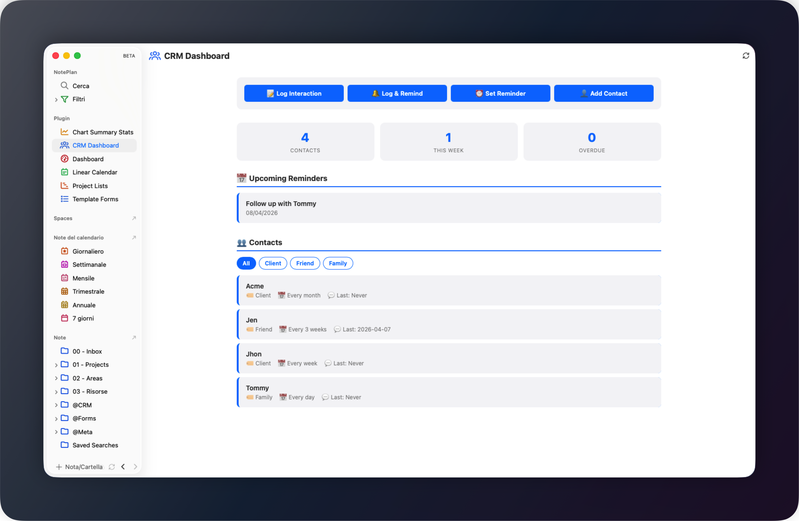

# 📇 CRM Dashboard for NotePlan

A lightweight CRM plugin for [NotePlan](https://noteplan.co/) that helps you manage contacts, log interactions, and schedule follow-up reminders—all stored as notes in your @CRM folder.



## Features

- ✅ **Manage Contacts** — Create and organize contacts by category (Client, Colleague, Friend, Family, Business, etc.)
- ✅ **Log Interactions** — Track every interaction with flexible timestamp formats (date only or date + time)
- ✅ **Schedule Reminders** — Automatically create follow-up reminders via Apple Reminders (native notifications) or NotePlan Tasks (visible in notecard/dashboard views)
- ✅ **CRM Dashboard** — Visual overview of all contacts, upcoming reminders, and overdue follow-ups
- ✅ **Flexible Configuration** — Customize tags, timestamps, interaction ordering, and navigation behavior
- ✅ **Sidebar View** — Quick access to your CRM dashboard from NotePlan's sidebar

## Installation

1. Clone or download this plugin to your NotePlan plugins folder:
   ```
   ~/Library/Containers/co.noteplan.NotePlan3/Data/Library/Application Support/Plugins/
   ```
2. Enable the plugin in NotePlan's Plugin Manager
3. Configure settings as needed (see [Settings](#settings) section)

## Quick Start

### Command Palette Access

Open the Command Palette (`Cmd+J`) and search for any of these commands:

| Command | Shortcut | Description |
|---------|----------|-------------|
| Add Contact | `ac` | Create a new contact with category and reminder frequency |
| Log Interaction | `li` | Record an interaction without scheduling a reminder |
| Log Interaction & Schedule Reminder | `lir` | Log an interaction and automatically schedule next follow-up |
| Set Reminder | `sr` | Manually set a specific reminder date for a contact |
| Show CRM Dashboard | `crm` | Open the CRM Dashboard in the sidebar |
| CRM Settings | `crms` | Update plugin configuration |

### Sidebar View

The **CRM Dashboard** can be accessed from the NotePlan sidebar by clicking the **CRM** icon or running the `Show CRM Dashboard` command.

## Commands in Detail

### 1. Add Contact (`ac`)

Create a new contact in your CRM:

1. Run **Add Contact** command
2. Enter the contact's name
3. Select a category:
   - **Client** — Business/professional contact
   - **Colleague** — Work peer
   - **Friend** — Personal friend
   - **Family** — Family member
   - Any custom categories you've defined in Settings
4. Select how often you want to connect with this contact:
   - Every day, week, 2 weeks, 3 weeks, month, 2 months, 3 months, 6 months, yearly, or **Never**

The contact is created as a `.md` file in your **@CRM** folder with the following structure:

```markdown
---
category: Category Name
frequency: Connection frequency
frequency_key: frequencyKey
last_contact: Never
tags: contact/Category
---
# Contact Name

## Photo

## Tasks

## Interactions
```

Properties are stored in **YAML frontmatter** so they appear as columns in NotePlan's notecard and column views. The `tags` field is used internally to identify and filter contacts.

**Automatic Reminder**: A follow-up reminder is automatically scheduled based on your chosen frequency and reminder backend (Apple Reminders or NotePlan task). If you select **Never**, no reminder is created.

### 2. Log Interaction (`li`)

Record an interaction with a contact without scheduling a new reminder:

1. Run **Log Interaction** command
2. Select a contact from the list
3. Choose the interaction type:
   - ☎️ **Call**
   - 📧 **Email**
   - 🤝 **Meeting**
   - 💬 **Text**
   - 📱 **Social**
   - 📝 **Other**
4. Add optional notes about the interaction

The interaction is logged in the contact's note under the **Interactions** section with a timestamp.

**Example**:
```
2026-04-07 | 14:30 ☎️ Call - Discussed Q2 project timeline
```

### 3. Log Interaction & Schedule Reminder (`lir`)

Record an interaction with a contact AND automatically schedule the next follow-up reminder:

1. Run **Log Interaction & Schedule Reminder** command
2. Select a contact
3. Choose interaction type
4. Add notes
5. The current reminder is completed automatically
6. **Next reminder** is scheduled based on the contact's configured frequency

This is the primary workflow for maintaining regular contact.

### 4. Set Reminder (`sr`)

Manually schedule a one-time reminder for a contact:

1. Run **Set Reminder** command
2. Select a contact
3. Choose when to connect:
   - **Today**
   - **Tomorrow**
   - **Next week**
   - **In 2 weeks**
   - **Next month**
4. Enter reminder text (e.g., "Discuss proposal", "Birthday gift")

The reminder appears in NotePlan's calendar.

### 5. Show CRM Dashboard (`crm`)

Open the **CRM Dashboard**, which displays:

**Statistics**:
- Total contacts
- Reminders due this week
- Overdue reminders

**Sections**:
1. **Upcoming Reminders** — Shows overdue and upcoming reminders for the week
2. **Contacts** — Displays all contacts with filters by category; click any contact to open their note
3. **Action Buttons** — Quick access to all major commands

**Features**:
- Click on a contact card to open the contact's note directly
- Filter contacts by category
- Click any button to execute commands directly from the dashboard
- Real-time reminders with visual distinction for overdue items (⚠️ in red)

### 6. CRM Settings (`crms`)

Configure plugin behavior through a settings interface. See [Settings](#settings) section.

## Settings

All settings are accessible via the **CRM Settings** command (`crms`).

### Contact & Folder

**Contact Tag Prefix** (`crm-relationship-tag`)
- **Default**: `contact`
- **Description**: The hashtag prefix used to categorize contacts
- **Example**: With default value, contacts are tagged as `#contact/Client`, `#contact/Friend`, etc.

**Custom Categories** (`crm-custom-categories`)
- **Default**: Empty
- **Description**: Additional contact categories beyond the built-in defaults (Client, Colleague, Friend, Family). Enter a comma-separated list.
- **Example**: `Mentor, Investor, Partner`
- **Use Case**: Extend the category list to match your specific relationship types

### Interaction Logging

**Timestamp Format** (`crm-interaction-datetime`)
- **Options**:
  - **Date Only**: `2026-04-07 ☎️ Call - ...`
  - **Date + Time**: `2026-04-07 | 14:30 ☎️ Call - ...`
- **Default**: `Date + Time`
- **Use Case**: Choose "Date Only" for a cleaner log; choose "Date + Time" for precise tracking

**Interaction Position** (`crm-interaction-position`)
- **Options**:
  - **append**: New interactions added at the bottom (chronological order)
  - **prepend**: New interactions added at the top, below the `## Interactions` heading (reverse chronological order)
- **Default**: `append`
- **Use Case**: Use "prepend" to see recent interactions first; use "append" for traditional chronological logs

### Reminders

**Reminder Backend** (`crm-reminder-backend`)
- **Options**:
  - **Reminders**: Apple Reminders — generates native system notifications
  - **NotePlan**: Tasks written inside the contact note under `## Tasks`, scheduled with `>YYYY-MM-DD` syntax — visible in NotePlan's notecard views and compatible with third-party dashboard plugins
- **Default**: `Reminders`
- **Use Case**: Choose "NotePlan" if you use a NotePlan dashboard plugin that aggregates tasks across notes

**Reminder List** (`crm-reminder-list`) *(Apple Reminders only)*
- **Default**: Empty (uses system default)
- **Description**: Choose which Reminders list all CRM reminders should be saved to. Leave empty to use NotePlan's default reminder list. Not used when the backend is set to "NotePlan".
- **Use Case**: Organize reminders by creating a dedicated "CRM" list or store them in "Work", "Personal", etc.
- **Configuration**: Set via the **CRM Settings** command to see all available reminder lists

### Navigation

**Open Contact Note After Logging Interaction** (`crm-navigate-after-interaction`)
- **Options**: `true` or `false`
- **Default**: `true`
- **Description**: When enabled, NotePlan navigates to the contact's note after logging an interaction. When disabled, you stay in your current context.
- **Use Case**: Enable for detailed editing; disable for quick logging without disrupting your workflow

## Data Structure

### Folder Organization

All contacts are stored in the **@CRM** folder as individual markdown files.

```
@CRM/
├── John Smith.md
├── Jane Doe.md
├── Acme Corporation.md
└── ...
```

### Contact Note Format

Each contact note follows this structure:

```markdown
---
category: Client
frequency: Every 2 weeks
frequency_key: twoWeeks
last_contact: 2026-04-07
tags: contact/Client
---
# Contact Name

## Photo

## Tasks
* [ ] Follow up with Contact Name >2026-04-21

## Interactions
<timestamp> <interaction_type> - <notes>
<timestamp> <interaction_type> - <notes>
```

**Example**:
```markdown
---
category: Client
frequency: Every 2 weeks
frequency_key: twoWeeks
last_contact: 2026-04-07
tags: contact/Client
---
# John Smith

## Photo

## Tasks
* [ ] Follow up with John Smith >2026-04-21

## Interactions
2026-04-07 | 14:30 ☎️ Call - Discussed Q2 deliverables
2026-03-24 | 10:15 📧 Email - Sent proposal
2026-03-10 | 15:45 🤝 Meeting - Initial kickoff
```

### Note Metadata

- **YAML Frontmatter**: `category`, `frequency`, `frequency_key`, `last_contact`, and `tags` are stored as frontmatter properties, which appear as columns in NotePlan's notecard and column views
- **`tags` field**: Used internally by the plugin to identify and filter contacts (e.g., `contact/Client`)
- **Photo heading**: Reserved section for attaching a contact photo
- **Tasks heading**: When using the NotePlan reminder backend, follow-up tasks are written here with a `>YYYY-MM-DD` scheduled date
- **Interactions heading**: All logged interactions are stored here with a timestamp

## Workflow Examples

### Example 1: Weekly Check-In

1. Run `Log Interaction & Schedule Reminder` (`lir`)
2. Select a contact
3. Log the interaction details
4. The next reminder is automatically scheduled for 1 week later

### Example 2: Quick Note Taking

1. Use `Log Interaction` (`li`) to quickly log a brief interaction without scheduling a reminder
2. Continue working without interruption
3. Set a dedicated reminder later if needed using `sr`

### Example 3: Bulk Contact Creation

1. Create multiple contacts at once using `Add Contact` (`ac`)
2. Set each contact's reminder frequency based on how often you want to connect
3. Access the **CRM Dashboard** (`crm`) to see all upcoming reminders

## Tips & Best Practices

### ✨ Maximize Effectiveness

- **Be Consistent**: Regularly use `Log Interaction & Schedule Reminder` to maintain accurate follow-up schedules
- **Use Categories Wisely**: Organize contacts by role or relationship type for better filtering and insights
- **Set Realistic Frequencies**: Choose reminder frequencies that match your actual capacity to connect
- **Dashboard as Hub**: Use the CRM Dashboard as your jumping-off point for all CRM activities

### 🎯 Productivity Tips

- Use **aliases** for faster command execution:
  - `ac` for Add Contact
  - `li` for Log Interaction
  - `lir` for Log Interaction & Schedule Reminder
  - `sr` for Set Reminder
  - `crm` for Show CRM Dashboard
  - `crms` for CRM Settings

- Use **prepend** interaction positioning to see recent activity first without scrolling

- Disable **navigate-after-interaction** if you log interactions while reviewing notes to stay in your current workflow

- Filter the dashboard by category to focus on specific contact groups

### 📋 Organization Tips

- Use consistent naming conventions for contacts (e.g., "FirstName LastName" or "Company Name")
- Add context in interaction notes for future reference
- Regularly review the **Overdue** section in the dashboard to catch fallen-through-the-cracks contacts

## Troubleshooting

### Contacts not appearing in the dashboard
- Ensure contacts are saved in the **@CRM** folder
- Check that contact files follow the required markdown format
- Try refreshing the dashboard by running `Show CRM Dashboard` again

### Reminders not triggering
- Verify that reminders are properly scheduled in NotePlan's calendar
- Check that the Calendar API is available in your NotePlan environment
- Ensure you have the correct reminder frequency set on the contact

### Settings not applying
- Restart the plugin by disabling and re-enabling it in Plugin Manager
- Clear the settings file if corruption is suspected (located in plugin preferences folder)

## Version History

**v1.2.0** — Custom categories & photo section
- New **Custom Categories** setting (`crm-custom-categories`): extend the built-in contact categories with a comma-separated list of your own (e.g. Mentor, Investor, Partner)
- Built-in default categories reduced to Client, Colleague, Friend, Family — add others via the new setting
- Contact notes now include a `## Photo` section for attaching a contact photo
- Contact notes now use a `tags` frontmatter field (e.g. `tags: contact/Client`) instead of an inline hashtag; contacts are filtered using this field
- Added **Never** as a valid reminder frequency (no reminder is created)

**v1.1.0** — NotePlan task backend & YAML frontmatter properties
- New **Reminder Backend** setting: choose between Apple Reminders (native notifications) or NotePlan Tasks (tasks stored in the contact note, compatible with NotePlan dashboard plugins)
- Contact notes now use **YAML frontmatter** for `category`, `frequency`, `frequency_key`, and `last_contact` — these appear as columns in NotePlan's notecard and column views
- Contact notes now include a `## Tasks` heading for NotePlan task scheduling
- Reminder list picker is now skipped when the NotePlan backend is selected

**v1.0.1** — Dashboard improvements and reminder list control
- Click on a contact card in the dashboard to open the contact's note directly
- Choose which Reminders list to use for CRM reminders (new **Reminder List** setting)
- Fixed dashboard button command names
- Improved dashboard refresh when settings change

**v1.0.0** — Initial release
- Core CRM functionality with contacts, interactions, and reminders
- CRM Dashboard with statistics and filtering
- Fully customizable settings

## Author

Created by **jokky102**

## License

See [LICENSE](LICENSE) file for details.

---

**Questions or Issues?** Please submit feedback or report bugs via the plugin's GitHub repository.